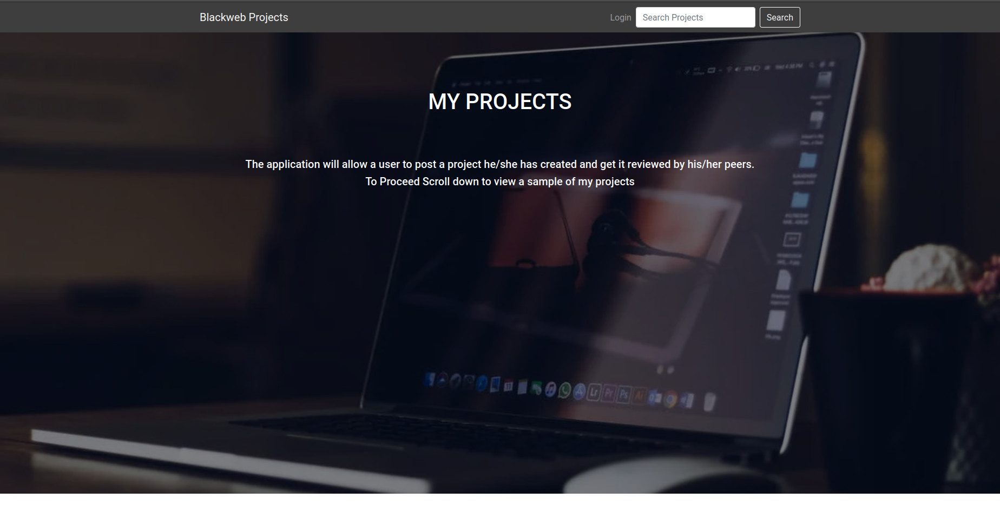
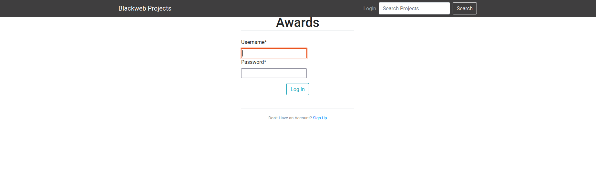
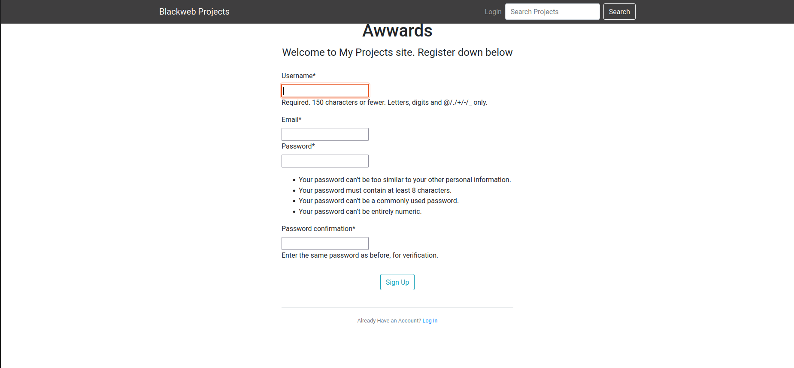

# Awwards-Web-App

## Author
Kipkemoi Jared Kevin

## Description
The application will allow a user to post a project he/she has created and get it reviewed by his/her peers.
## Setup/Installation Requirements
1.Clone the repository https://github.com/JAREDKEVIN/Awwards-Web-App.git
2.Open Terminal Command line,Navigate to project folder.
3.Cd to project.
4.Run project using _python3 manage.py runserver_

## User Experience

1.Landing Page

2.Login Into Your Account

3.Sign Up

## Live Link
https://github.com/JAREDKEVIN/Awwards-Web-App.git

## Prerequisities
Create and activate Virtual env then install pip To install django -pip install django LTS Have basic git knowledge

'''
python3.9 -m venv --without-pip virtual
source virtual/bin/activate
pip install django

'''

## User Stories
As User you will like to:
-Search for projects.
-Post a project to be rated/reviewed.
-Rate/review other users' projects.
-View posted projects and their details.
-View projects overall score
-View my profile page.

## Contributing
If you have a suggestion that would make this better, please fork the repo and create a pull request.

1.Fork the Project.
2.Create your Feature Branch (git checkout -b feature/AmazingFeature)
3.Commit your Changes (git commit -m 'Add some AmazingFeature')
4.Push to the Branch (git push origin feature/AmazingFeature)
5.Open a Pull Request

## Known Bugs
There are no known bugs.

## Technologies Used
* Python3

* Django

* Flask-Bootstrap

* CSS

* Postgres

## Support and contact details

For support and contact detail Email at @JAREDKEVIN

## License
Licence under [MIT](https://choosealicense.com/licenses/mit/#)LICENCE 
Copyright (c) {2022} 
